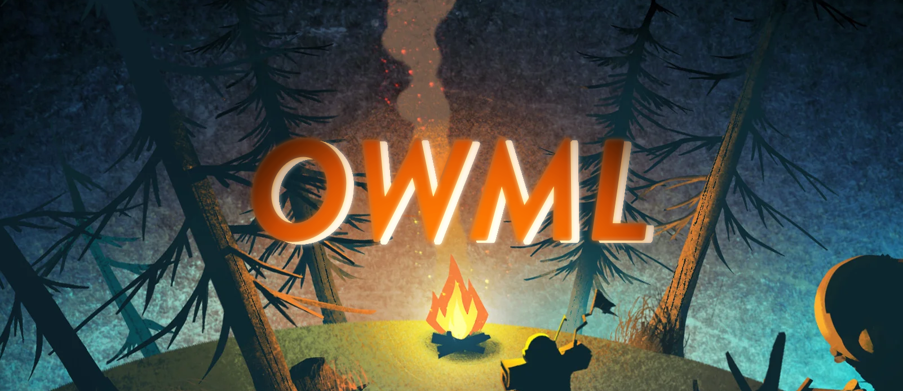

# Outer Wilds Mod Loader

OWML is the mod loader and mod framework for Outer Wilds. It patches Outer Wilds to load mods, and provides mods a framework to interact with the game. OWML is inspired by SMAPI for Stardew Valley.

## How it works

OWML does the following:
1. Patches the game to make it call the mod loader.
2. Starts the game.
3. The mod loader loads and initializes installed mods.

## Installation

With Outer Wilds Mod Manager (recommended):
1. Download the Mod Manager from the [Outer Wilds Mods](https://outerwildsmods.com/) website.
2. Use the Mod Manager to install OWML and mods, and start the game.

Manual install:
1. Download latest OWML release and extract the zip file anywhere you want.
2. [Download Outer Wilds mods](https://outerwildsmods.com/mods) and put them in the `mods` folder, each mod in a separate folder.
3. Start the game with OWML.Launcher.exe.

## Uninstall
- If using Outer Wilds Mod Manager, first refer to it's uninstall guide.
- If not, delete OWML folder.
- Verify integrity of game files - OWML edits the game code to load itself, so verification is needed to remove the changes.
  - Steam : Right click on game > Properties > Local files > Verify integrity of game files
  - Epic : Three dots next to game > Verify

If you want to keep mod data intact but still play without mods, verifying the game files is enough. Just make sure to run the game through Steam/Epic, *not* OWML.Launcher.exe.

## For modders

Refer to the sample mods in the source code for examples. These mods are not included in releases.

### Get started

To get started, check out [our tutorial on the docs]("https://owml.outerwildsmods.com/guides/getting_started.html")

## Compatibility

|Version|Compatible|
|-|-|
|1.1.10|Yes|
|1.1.9|Unknown|
|1.1.8|Unknown|
|1.0.0 - 1.0.7|No|

OWML is compatible with Echoes of the Eye, and works on both Epic and Steam installations.

## Feedback and Support

OWML is developed by some of the same people making the mods!
On the [Outer Wilds Modding Discord](https://discord.gg/9vE5aHxcF9), we are:
- alek
- Raicuparta
- _nebula
- TAImatem

Feature requests, bug reports and PRs are welcome on GitHub.

## Credits

Authors:
* [AmazingAlek](https://github.com/amazingalek)
* [Raicuparta](https://github.com/Raicuparta/)
* [_nebula](https://github.com/misternebula)
* [TAImatem](https://github.com/TAImatem)

Contributors:
* [salomj](https://github.com/salomj) - Helped with menus and inputs.
* [artum](https://github.com/artumino) - Helped with menus and patchers.
* [JohnCorby](https://github.com/JohnCorby) - Helped with audio loading stuff.

Special thanks to:
* [Outer Wilds](http://www.outerwilds.com)
* [Outer Wilds on Reddit](https://www.reddit.com/r/outerwilds)
* The unnofficial Outer Wilds Discord
* Inspired by (and some code from) [SMAPI](https://smapi.io)
* OWML logo banner by _nebula

Dependencies:
* [dnpatch](https://github.com/ioncodes/dnpatch)
* [dnlib](https://github.com/0xd4d/dnlib)
* [HarmonyX](https://github.com/BepInEx/HarmonyX)
* [ObjImporter](https://wiki.unity3d.com/index.php?title=ObjImporter)
* [NAudio-Unity](https://github.com/WulfMarius/NAudio-Unity)
* [Gameloop.Vdf](https://github.com/shravan2x/Gameloop.Vdf)
