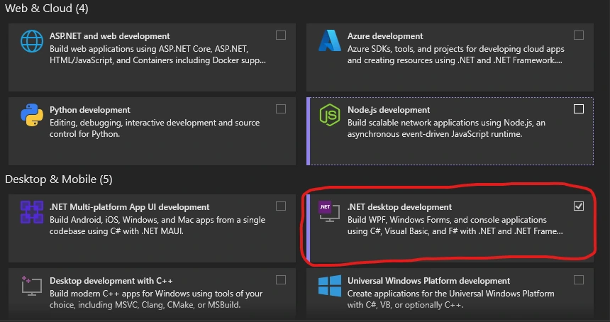

import { Aside, FileTree, Tabs, TabItem } from '@astrojs/starlight/components';

This page will outline how to get a working mod that will simply log a message to the console when the game starts.

For this guide we'll assume you already have the [Outer Wilds Mod Manager](https://https://outerwildsmods.com/mod-manager/) installed.


## Choosing an IDE

An IDE will help provide the ability to create, edit, and build your mod.

The recommended IDE for modding is [Visual Studio](https://visualstudio.microsoft.com/). 

On Linux (or if you just don't want to use Visual Studio), use the "Other Editors" tab to get instructions for a non-VS developer setup.

## Editor Setup

<Tabs syncKey="editor">
  <TabItem label="Visual Studio">
  Head to the [Visual Studio downloads page](https://visualstudio.microsoft.com) and select Community if asked what edition to install. After downloading and launching the installer, follow instructions until you reach this screen:

  

  We want the "Desktop development with .NET" module, this will provide us with the tools we need to build the mod.

  After installing Visual Studio, launch it once and then close it, this will ensure certain files are generated.
  </TabItem>
  <TabItem label="Other Editors">
    If your editor supports LSP, I'd recommend the [C# language server](https://github.com/razzmatazz/csharp-language-server/tree/main). It's based on Roslyn which is the same "engine" Visual Studio uses for C#.

    You will also need a .NET toolchain available. 

    - On Windows, follow the "Visual Studio" setup tab to install .NET framework via the Visual Studio Installer
    - On Linux, it will depend on your distro. Follow the [.NET install guide](https://learn.microsoft.com/en-us/dotnet/core/install/linux)
  </TabItem>
</Tabs>

## Installing the Template

We provide a template to make creating mods easier, this template will handle renaming files and changing the manifest.

To install the template, open a terminal and run the following command:

```sh title="Install The Template"
dotnet new --install Bwc9876.OuterWildsModTemplate
```

This will give an output similar to this:

```txt frame="terminal"
--------------------------------------------------------------------------------------
The following template packages will be installed:
   Bwc9876.OuterWildsModTemplate

Success: Bwc9876.OuterWildsModTemplate::1.3.0 installed the following templates:
Template Name    Short Name     Language  Tags
---------------  -------------  --------  -------
Outer Wilds Mod  OuterWildsMod  [C#]      Library
```

## Using the Template

This will depend on what editor you're using

<Tabs syncKey="editor">
  <TabItem label="Visual Studio">
  Open Visual Studio and select "New Project" from the welcome screen. Then search "Outer Wilds" and the template should appear in the list.

  Set the project name to the name of your mod, **please note this should NOT have spaces or special characters in it**.  The standard casing for projects is PascalCase, which involves capitalizing the start of every word and removing spaces.

  On the next screen, set the author name to the name you want to appear in the manager and on the website, **this should also not contain spaces**

  Finally, click "Create Project"
  </TabItem>
  <TabItem label="Other Editors">
  You'll need to create a project via the `dotnet new` CLI.

  ```sh
  dotnet new sln --name MySolutionName
  dotnet new OuterWildsMod -n MyProjectName --AuthorName MyName
  dotnet sln add MyProjectName/
  ```

  See the [Outer Wilds Mod Template README](https://github.com/ow-mods/ow-mod-template/tree/main#readme) for a list of options.
  </TabItem>
</Tabs>
  

## General Mod Layout

The general layout of an Outer Wilds mod is as follows:

<FileTree>
- YourProjectName/
  - default-config.json
  - manifest.json
  - YourProjectName.cs
  - YourProjectName.csproj (Hidden in Visual Studio)
</FileTree>

### manifest.json

This file contains metadata about your mod, such as its name, author, and version.

### YourProjectName.cs

This file should have been renamed to your project name, it acts as the entry point for the mod.

### default-config.json

This file is used by OWML to generate the settings menu for your mod, we'll go over it in another guide

### YourProjectName.csproj

This file tells Visual Studio about your project, it determines stuff like dependencies and versions, you shouldn't need to touch this. If you're using Visual Studio, this file won't be explicitly listed. Instead it will be the parent of all files in the project.

## The ModBehaviour File

Double-click YourProjectName.cs, and it should open up in the main editor pane.

This file should contain a class that has the same name as your project and some methods within that class.

The class this class inherits from is `ModBehaviour`, which is a special `MonoBehaviour` that not only marks a class as the entry-point for a mod, but also provides various utilities and overridable methods.

We'll focus on `Start()`. In this method we do two things:

1. We output a message to the console alerting the user that the mod has loaded
2. We subscribe to the scene loaded event to output a message to the log when the SolarSystem scene is loaded.

You may have noticed we use the ModHelper field to achieve console output, ModHelper is a collection of utilities your mod can use to do a variety of things. It's covered in the "Mod Helper" section of the site.

<Aside type="caution">
There's only one `ModBehaviour` allowed per-mod. To add more components, you'll need to use `AddComponent<>` within your mod behaviour class.
</Aside>

## Building The Mod

<Tabs>
  <TabItem label="Visual Studio">
  Now that we know what the mod *should* do, let's make sure it does it. Building your mod should be as simple as pressing "Solution -> Build Solution" in the menu bar
  </TabItem>
  <TabItem label="Other Editors">
  You _should_ just be able to run `dotnet build`. If not try running `dotnet restore` first. You may need to get the Mono runtime.
  </TabItem>
</Tabs>

<Aside type="caution">
The mod template assumes your OWML mods folder is in a standard location.

- `%APPDATA%/OuterWildsModManager/OWML/Mods` on Windows
- `~/.local/share/OuterWildsModManager/OWML/Mods` on Linux

If you have OWML installed somewhere else, you may want to create a symlink from the standard location to your actual mods folder or change the output path in `YourProject.csproj.user`.
</Aside>

## Running The Mod

Now the mod should have appeared in your mod manager at the very bottom, notice how the download count is a dash.

Your mod should now be ready to run!

Click start game and wait for the title screen to load in. Now search your manager logs (there's a search box) for a message along the lines of "My mod YourProjectName is loaded!".  This means your mod was loaded successfully! You can also try loading into the main game and checking the logs for another message from your mod.

## Getting Line Numbers

If you want to know _where_ errors are happening in your mod, you can download the [Line Numbers](https://outerwildsmods.com/mods/linenumbers/) mod to make error messages include them!

You must build your mod using the "Debug" release candidate for line numbers to appear.

## Next Steps

You've successfully created and built your first Outer Wilds mod, moving forward may require a bit of knowledge in unity and will depend on what exactly you're trying to do. You may want to read the following guides to get an idea of how to make your mod:

- [Patching the game with HarmonyX](/guides/patching)
- [Interacting With Other Mods via APIs](/guides/apis)
- [Creating custom mod settings](/guides/mod-settings)
- [Publishing your mod](/guides/publishing)

<Aside type="tip" title="But wait! There's more!">
These guides will provide information on how to use various aspects of OWML, but they won't cover everything. 

Make sure to check out the [Start Here](/start-here) page for good resources on building your mod!
</Aside>
